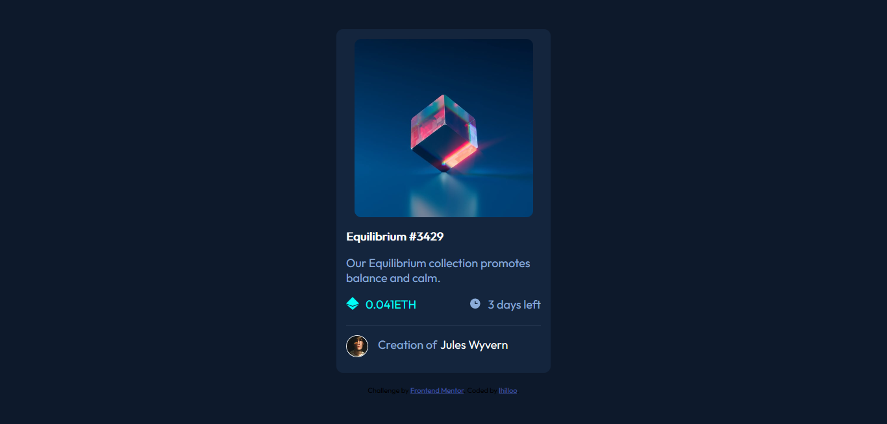
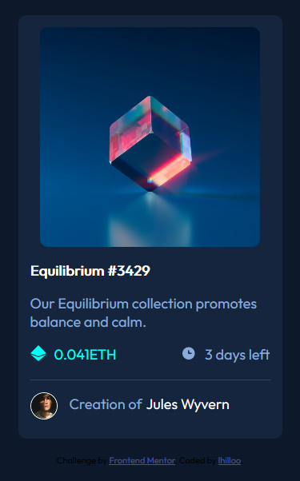

# Frontend Mentor - NFT preview card component solution

This is a solution to the [NFT preview card component challenge on Frontend Mentor](https://www.frontendmentor.io/challenges/nft-preview-card-component-SbdUL_w0U). Frontend Mentor challenges help you improve your coding skills by building realistic projects. 

## Table of contents

- [Overview](#overview)
  - [The challenge](#the-challenge)
  - [Screenshot](#screenshot)
  - [Links](#links)
- [My process](#my-process)
  - [Built with](#built-with)
  - [What I learned](#what-i-learned)
  - [Continued development](#continued-development)
  - [Useful resources](#useful-resources)
- [Author](#author)

**Note: Delete this note and update the table of contents based on what sections you keep.**

## Overview

### The challenge

Users should be able to:

- View the optimal layout depending on their device's screen size
- See hover states for interactive elements

### Screenshot

### Links

- Solution URL: https://github.com/lhilloo/nft-preview-card
- Live Site URL: https://lhilloo.github.io/nft-preview-card/

## My process

### Built with

- Semantic HTML5 markup
- CSS custom properties
- Flexbox

### What I learned

I have learn a lot of things especially on CSS Flexbox, and coding a design. It's a great experience for a student like me (as of now I'm a 4th year BSIT student) for making me code like a frontend dev. Tho this is only a beginner's project, it's a good practice to learn more about the fundamentals of frontend development

### Continued development

I will try and do learn more about complex frontend coding like adding some Javascript on my future projects and create more cool projects with the help of Frontend Mentor

### Useful resources

- W3Schools(https://www.w3school.com) - This helped me for refreshing some basic html and css codes that I forgot. I will keep on making this website as a reference as it provide detailed guide.

## Author

- Website - Khalil Gibran Coral(https://lhilloo.github.io/fcb-portfolio-lhilloo/)
- Frontend Mentor - [@lhilloo](https://www.frontendmentor.io/profile/lhilloo)

